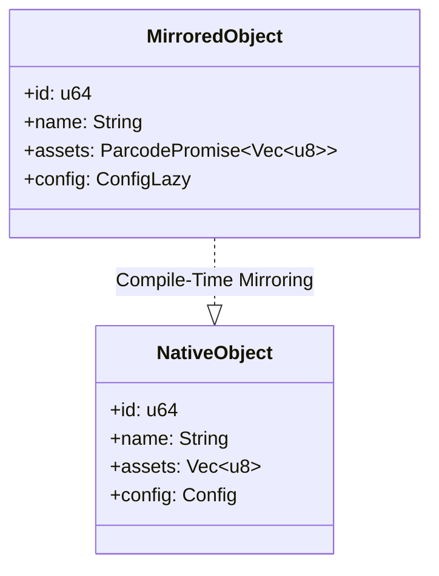
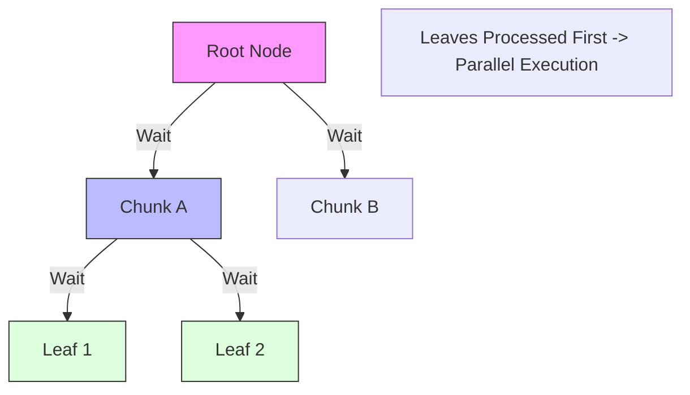

# Parcode: High-Performance Object Persistence via Compile-Time Structural Mirroring

## Technical Whitepaper v0.4.0

**Date:** December 2025
**Author:** RetypeOS Team
**Repository:** [github.com/retypeos/parcode](https://github.com/retypeos/parcode)

---

## Abstract

High-performance systems frequently face a fundamental trade-off in data persistence. Sequential serialization formats (e.g., Serde+Bincode) offer high write throughput and strong language ergonomics but impose linear-time read costs and full materialization. Conversely, embedded databases provide efficient random access at the expense of schema complexity, write amplification, and reduced alignment with native language data structures.

**Parcode** introduces **Compile-Time Structural Mirroring (CTSM)**, a persistence architecture that derives a lightweight, navigable in-memory representation of complex Rust object graphs at compile time. This mirrored structure preserves the full topology of the original data while deferring the materialization of heavy payloads until explicitly requested.

By combining CTSM with a graph-based parallel write engine and adaptive data sharding, Parcode enables sub-millisecond cold starts, constant memory overhead during traversal, and fine-grained random access—while retaining the ergonomics of idiomatic Rust structs and eliminating the need for external schemas or IDLs.

---

## 1. Introduction: The Persistence Trade-Off

Modern Rust applications—particularly in game engines, simulations, and data-intensive tooling—frequently manipulate deeply nested and heterogeneous data structures. Persisting such structures efficiently remains a non-trivial challenge.

### 1.1 Sequential Serialization

Formats such as Bincode or Postcard serialize entire object graphs into linear byte streams.

#### Advantages of Sequential Serialization

* High throughput
* Simple mental model
* Native Rust ergonomics

#### Limitations of Sequential Serialization

* Full deserialization is required to access any field
* Read amplification grows linearly with dataset size
* Memory usage scales with total object size

### 1.2 Structured Storage Engines

Embedded databases and structured binary formats (e.g., SQLite, LMDB, FlatBuffers) organize data to support random access.

#### Advantages of Structured Storage

* Low-latency reads
* Partial loading

#### Limitations of Structured Storage

* External schemas or IDLs
* Schema evolution complexity
* Reduced alignment with native language types

---

## 2. Compile-Time Structural Mirroring (CTSM)

Parcode addresses this gap by treating the **Rust type system itself as the persistence schema**. Instead of flattening objects into opaque blobs, Parcode derives a structural mirror of each serializable type at compile time.

### 2.1 Core Idea

CTSM separates data into two conceptual layers:

1. **Inline Structural Data:**
    * Primitive fields (`u32`, `bool`, short `String`).
    * Identifiers and flags required for navigation.
    * *Always materialized instantly.*

2. **Deferred Payloads:**
    * Large vectors (`Vec<T>`).
    * HashMaps (`HashMap<K,V>`).
    * Deep substructures marked as chunkable.
    * *Represented by compact references.*

The inline layer is always materialized, forming a complete structural view of the object graph. Deferred payloads are represented by compact references and loaded only on demand.

---

### 2.2 Structural Mirroring via Procedural Macros

The `#[derive(ParcodeObject)]` macro analyzes Rust structs at compile time and generates a mirrored representation in which selected fields are replaced by lazy handles.

This mirrored object:

* Preserves the original structure and field layout
* Occupies a bounded amount of memory
* Can traverse arbitrarily large datasets without triggering I/O

---

### 2.3 Deferred Materialization with `ParcodePromise<T>`

Deferred fields are represented by `ParcodePromise<T>`, a zero-cost abstraction holding a 16-byte reference (Offset + Length) to a physical chunk on disk.

**Key Properties:**

* **Zero Allocation:** The promise itself is just a struct with two `u64`.
* **Zero I/O:** Accessing the field incurs no disk read.
* **Explicit Control:** Materialization happens only via `.load()`.

This design ensures that memory usage scales with *used data*, not *available data*.

---

## 3. Graph-Based Write Architecture

Supporting CTSM requires a write strategy fundamentally different from sequential serialization. Parcode employs a **graph-based serialization engine** that models persistence as a dependency graph.

### 3.1 Dependency Graph Construction

When `Parcode::save` is invoked:

* The object graph is traversed
* Each persistable unit (vector shard, map bucket, struct node) becomes a node
* Dependencies are encoded as edges (parent → child)

The resulting structure is a Directed Acyclic Graph (DAG).

---

### 3.2 Bottom-Up Parallel Execution

The DAG is executed using a reactive, bottom-up strategy optimized for multi-core processors and NVMe storage:

1. **Leaf Scheduling:** Nodes with zero dependencies are scheduled first.
2. **Parallel Processing:** Leaves are serialized and compressed concurrently.
3. **Atomic Propagation:** Completion of a child atomically decrements the parent's dependency counter.
4. **Immediate Wake-up:** Parents execute immediately once all dependencies resolve.

This minimizes synchronization, avoids global locks, and maximizes CPU and NVMe utilization.

This ensures the Root Node is written last, acting as a complete structural index for the file.

---

## 4. Adaptive Data Structures

Parcode transforms standard Rust collections into storage-aware structures optimized for partial access.

---

### 4.1 Adaptive Vector Sharding

Large `Vec<T>` instances are partitioned into shards using adaptive heuristics:

* Target shard sizes (~128 KB) for SSD efficiency
* Forced subdivision to ensure sufficient parallelism

#### **Parallel Reconstruction**

* Allocate a single output buffer
* Decompress shards in parallel
* Write into disjoint memory regions
* Finalize once all shards validate integrity

This enables fast, bounded-memory reconstruction even for large vectors.

---

### 4.2 HashMap Sharding for Random Access

For `HashMap<K, V>`, Parcode applies hash-based partitioning:

1. Keys are hashed (xxHash64)
2. Entries are distributed into $N$ buckets.
3. Each bucket is stored as an independent chunk using a Structure of Arrays (SOA) layout.

**Bucket Layout:**

`[Count] [Hash Array (Aligned)] [Offset Array] [Data Blob]`

**Lookup Flow:**

* Compute `bucket_idx`.
* Load *only* that bucket (e.g., 4KB).
* SIMD scan the Hash Array.
* Deserialize value at offset.

Retrieving a single entry requires loading only a tiny fraction of the total map size.

---

## 5. Safety Model

Parcode uses `unsafe` internally for performance-critical paths but exposes a fully safe public API.

### **Guarantees**

* All unsafe code is encapsulated
* No panics in runtime paths
* Explicit error propagation via `Result<T>`

Additionally, Parcode provides a forensic inspection tool to audit file structure, sharding decisions, and compression behavior without deserializing payloads.

---

## 6. Performance Evaluation

This section evaluates Parcode against **Cap’n Proto**, **Bincode**, and **Postcard**, with emphasis on *observable access latency* rather than raw serialization throughput. All benchmarks were executed on **Linux (WSL2)** using Criterion.

### Dataset

* ~10 MB total size
* 100,000 user records
* One binary asset (~10 MB)
* Nested metadata and indexed collections

Reported values represent median timings.

---

### Write Performance

| Format      | Write Time |
| ----------- | ---------: |
| Cap’n Proto |     ~95 ms |
| Parcode     |    ~136 ms |
| Postcard    |    ~119 ms |
| Bincode     |    ~299 ms |

Parcode’s write performance includes the cost of DAG construction and chunk partitioning. While not yet optimized for peak throughput, this overhead is a consequence of preparing the file layout required for true lazy access. Significant improvements are expected as the chunk-based writer matures.

---

### Cold-Start Metadata Load

Cold start measures the time required to open the file and make structural metadata available without materializing payloads.

| Format      |   Cold Start |
| ----------- | -----------: |
| **Parcode** | **~1.38 ms** |
| Cap’n Proto |       ~60 ms |
| Postcard    |       ~80 ms |
| Bincode     |      ~299 ms |

Parcode achieves sub-millisecond cold starts by loading only the structural graph generated via Compile-Time Structural Mirroring. Other formats require partial or full deserialization before any meaningful access is possible.

---

### In-Memory Access Costs

Once data is reachable, individual field access costs are comparable across formats and dominated by CPU cache behavior.

| Format      |   Time |
| ----------- | -----: |
| Bincode     | ~15 ns |
| Parcode     | ~17 ns |
| Postcard    | ~17 ns |
| Cap’n Proto | ~46 ns |

At this scale, differences are negligible for end-to-end latency.

---

### Why Parcode Is Truly Lazy

Parcode’s goal is not to minimize the cost of *accessing already-loaded data*, but to minimize the **total time to access a specific piece of data starting from a cold file**.

In real systems, workloads frequently involve:

* Accessing a single field or record
* Looking up one element in a large collection
* Inspecting metadata without touching large payloads
* Accessing a single or few elements in a large object graph

For these cases, the relevant metric is:

> **Cold-start latency + targeted access time**

---

### End-to-End Observable Access Latency

The following table combines cold-start time with the cost of accessing a specific data element, illustrating the practical advantage of Parcode’s lazy model.

| Operation                    |      Parcode | Cap’n Proto | Bincode | Postcard |
| ---------------------------- | -----------: | ----------: | ------: | -------: |
| Metadata read (cold)         | **~1.38 ms** |      ~60 ms | ~299 ms |   ~80 ms |
| Metadata + deep field access | **~1.40 ms** |      ~60 ms | ~299 ms |   ~80 ms |
| Metadata + map lookup        | **~1.54 ms** |      ~64 ms | ~299 ms |   ~80 ms |

Parcode consistently minimizes the *observable latency* for point-access workloads by avoiding eager deserialization of unrelated data. Other formats pay their full initialization cost upfront, regardless of how little data is ultimately accessed.

---

### Summary

Parcode is designed for **true lazy access**: constant-time cold starts, bounded memory usage, and direct access to any data within the file. Its performance characteristics reflect deliberate architectural trade-offs enabled by Compile-Time Structural Mirroring and chunk-based persistence.

---

## 7. Conclusion

Parcode demonstrates that high-performance persistence does not require sacrificing language ergonomics or introducing external schemas. Through **Compile-Time Structural Mirroring**, Parcode enables efficient navigation of large object graphs with constant memory overhead and explicit, controlled materialization.

This approach is particularly well-suited for read-heavy workloads, large world states, and systems where cold-start latency and memory predictability are critical.
